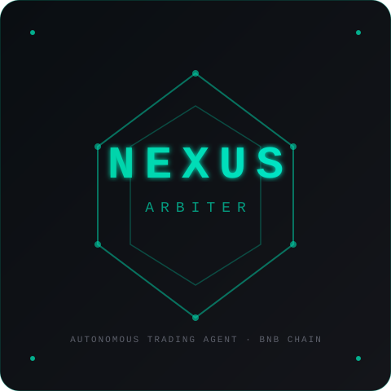

# NEXUS Arbiter

**Autonomous AI Trading Agent for BNB Smart Chain**

> 🏆 BNB Hack: AI Trading Agents (June 2026) — Track 1 (Autonomous Trading) + Track 2 (Strategy Skills)

NEXUS Arbiter is a deterministic 7-stage autonomous trading agent that executes multi-strategy crypto trades on BSC. It replaces emotional decision-making with a verifiable pipeline validated on 155 live trades.



## Architecture

```
                    ┌──────────────────────────┐
                    │     CMC Agent Hub         │
                    │  (market data, trends,    │
                    │   F&G, narratives)        │
                    └───────────┬──────────────┘
                                │
                    ┌───────────▼──────────────┐
                    │    Stage 1: Strategy      │
                    │    Selection (22 strats)  │
                    └───────────┬──────────────┘
                                │
                    ┌───────────▼──────────────┐
                    │    Stage 2: Risk Assess   │
                    │    (degradation, kill-    │
                    │     switch, exposure)     │
                    └───────────┬──────────────┘
                                │
        ┌───────────────────────┼───────────────────────┐
        │                       │                       │
        ▼                       ▼                       ▼
┌───────────────┐     ┌───────────────┐     ┌───────────────┐
│ Stage 3:      │     │ Stage 4:      │     │ Stage 5:      │
│ Regime Detect │     │ Position Size │     │ Trade Execute │
│ (F&G + TA +   │     │ (dynamic ×    │     │ (Trust Wallet │
│  derivatives) │     │  regime)      │     │  Agent Kit)   │
└───────────────┘     └───────────────┘     └───────────────┘
        │                       │                       │
        └───────────────────────┼───────────────────────┘
                                │
                    ┌───────────▼──────────────┐
                    │    Stage 6: Exit Mgmt     │
                    │    (TP/SL/decay/force)   │
                    └───────────┬──────────────┘
                                │
                    ┌───────────▼──────────────┐
                    │    Stage 7: Performance   │
                    │    Audit (trades.db SSOT) │
                    └──────────────────────────┘
```

## Key Features

- **22 Strategies**: Simultaneous execution with dynamic weight allocation
- **Deterministic Arbiter**: 7-stage pipeline with clear precedence (manual > degradation > rewiring > performance > guardrails)
- **Risk Management**: Diversity floor (≥3 strats), concentration cap (50%), automatic kill-switch
- **CMC Agent Hub**: Live market data via MCP server (12 tools: F&G, technicals, derivatives, narratives)
- **Trust Wallet Agent Kit**: Self-custody transaction signing on BSC
- **155 Live Trades**: Validated on BSC mainnet (March–June 2026)
- **SSOT**: SQLite `trades.db` as single source of truth for all performance data

## Tech Stack

| Component | Technology |
|-----------|-----------|
| Chain | BNB Smart Chain (BSC) |
| Data | CMC MCP Server (`mcp.coinmarketcap.com/mcp`) |
| Signing | Trust Wallet Agent Kit |
| Strategies | 22 (Reclaim Entry, SFP, Trendline, Crisis Rebound, etc.) |
| Risk | Dynamic Rewiring, Degradation, Kill-Switch |
| DB | SQLite `trades.db` (SSOT) |
| Language | Python 3.11 |

## CMC Skills

This repo includes two CMC Agent Hub Skills for Track 2:

- **[nexus-regime](skills/nexus-regime/SKILL.md)** — Multi-factor market regime detection (F&G, TA, derivatives, global metrics)
- **[nexus-signal](skills/nexus-signal/SKILL.md)** — Trading signal generation with backtest validation

## Quick Start

```bash
# Clone
git clone https://github.com/Bullit84/nexus-arbiter.git
cd nexus-arbiter

# Install CMC MCP integration
pip install mcp httpx

# Configure
export CMC_API_KEY="your-cmc-api-key"
export BSC_RPC_URL="your-bsc-rpc"
export WALLET_PRIVATE_KEY="your-wallet-key"

# Run regime check
python -m nexus.regime
```

## Live Performance

**155 trades** on BSC mainnet (March–June 2026):

| Strategy | Trades | Win Rate | PnL |
|----------|--------|----------|-----|
| Reclaim Entry | 40 | 25.0% | -$55 |
| SFP | 21 | 42.9% | -$9 |
| Trendline 3rd Touch | 16 | 56.2% | +$15 |
| Crisis Rebound | 6 | 83.3% | +$5 |

*Full audit: `SELECT * FROM trades.db` (SSOT)*

## Roadmap

- [x] Strategy Arbiter (7-stage pipeline)
- [x] CMC Agent Hub integration
- [x] Dynamic weight allocation with diversity floor
- [x] BTC invalidation gate with hysteresis
- [ ] Trust Wallet Agent Kit integration (in progress)
- [ ] CMC Strategy Skills submission
- [ ] Live trading window (June 22–28)

## License

MIT
